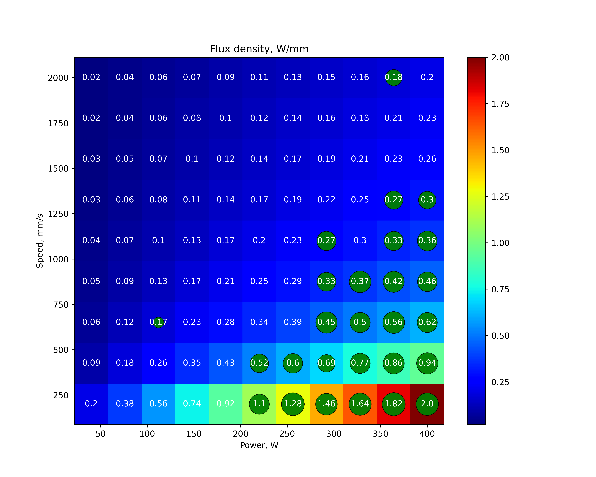

# Визуализация данных лазерной сварки

Данный код позволяет оценить взаимосвязь между технологическими параметрами, которые были заданы перед сплавлением единичного трека, и параметрами качества, то есть шириной и длиной трека, его площадью, а также параметр линейности (extent):

$$extent = \dfrac{S_{track}}{S_{bbox}},$$
где $S_{track}$ - площадь трека, покрытая маской (полученная площадь трека), $S_{bbox}$ - площадь габаритного прямоугольника, описанного вокруг трека.

 </img>

Таким образом параметр $extent$ показывает насколько трек извилистый ($extent < 0.5$) или прямой ($extent > 0.5$). Последнее наиболее предпочтительно с точки зрения параметров качества.

## Структура программы.

Программа состоит из двух частей: первая часть - обработать (применить нормализацию и получить маски изображений) исходные данные, вторая часть - визуализировать полученные данные.

### Первая часть.
Для получения пороговых значений используется алгоритм Отцу. Для этого в каждом канале изображения вычисляется гистограмма, а затем находится пороговое значение, при котором минимизируется внутриклассовая дисперсия $sigma_w$:
$$ \sigma_{w}^2 = \dfrac{w_1^2 \sigma_1^2 + w_2^2 \sigma_2^2}{w_1^2 + w_2^2},$$
где $w_1$ и $w_2$ - веса классов, $\sigma_1$ и $\sigma_2$ - дисперсии классов.

После этого изображение бинаризуется с помощью порогового значения. Для получения маски трека используется морфологическая операция открытия, а для получения маски фона - морфологическая операция закрытия. После этого маски трека и фона складываются, а затем применяется морфологическая операция закрытия. Полученная маска трека исходного изображения применяется для выделения трека на изображении, а также для вычисления площади трека.

Некоторые треки были обработаны вручную из-за проблем с бинаризацией. Все обработанные треки находятся в папке `./data/masks`. Все исходные изображения находятся в папке `./data/images`.

### Вторая часть.
Используется метод `measure.label` из библиотеки `skimage`, позволяющий получить метки бинарного изображения (смотри часть 1). На основании полученных данных выбираются треки у которых на снимке только одна метка (то есть трек непрерывный). Для каждого трека вычисляется площадь трека, ширина и длина трека, а также параметр $extent$. Далее строится график зависимости параметров качества от технологических параметров.

## Результаты.
Таблица 1. Параметры качества и технологические параметры для треков, полученных в ходе эксперимента:

| track_id | area_mm2 | bbox_area_mm2 | extent |
|----------|----------|---------------|--------|
| 24       | 0.770    | 4.667         | 0.165  |
| 52       | 2.094    | 4.122         | 0.508  |
| 53       | 3.195    | 5.407         | 0.591  |
| 61       | 2.396    | 4.269         | 0.561  |
| 62       | 5.104    | 6.650         | 0.768  |
| 67       | 1.787    | 3.278         | 0.545  |
| 68       | 1.930    | 3.694         | 0.522  |
| 69       | 2.232    | 3.331         | 0.670  |
| 70       | 2.735    | 6.086         | 0.449  |
| 71       | 5.063    | 7.390         | 0.685  |
| 77       | 1.803    | 2.611         | 0.690  |
| 78       | 2.171    | 3.618         | 0.600  |
| 79       | 3.054    | 5.102         | 0.599  |
| 80       | 7.253    | 10.040        | 0.722  |
| 81       | 1.090    | 2.793         | 0.390  |
| 84       | 2.018    | 4.096         | 0.493  |
| 85       | 2.638    | 4.857         | 0.543  |
| 86       | 2.366    | 3.629         | 0.652  |
| 87       | 2.957    | 4.245         | 0.697  |
| 88       | 3.605    | 5.497         | 0.656  |
| 89       | 7.741    | 9.900         | 0.782  |
| 93       | 1.549    | 3.428         | 0.452  |
| 94       | 2.242    | 3.901         | 0.575  |
| 95       | 2.267    | 4.036         | 0.562  |
| 96       | 2.488    | 4.220         | 0.590  |
| 97       | 3.731    | 5.592         | 0.667  |
| 98       | 7.412    | 10.094        | 0.734  |

График 1. Исходное окно параметров (V-P):
 </img>

График 2. Окно параметров с учетом параметра качества ($extent$):
 </img>